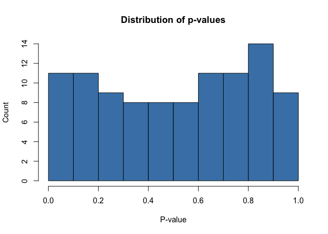
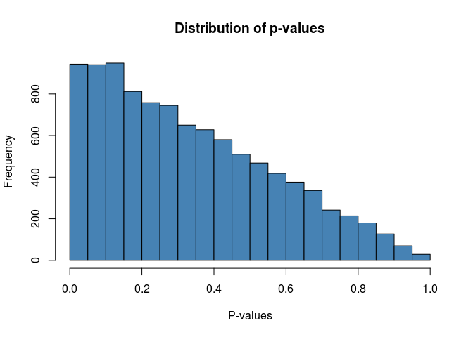

The problem of covariate selection can be tough, how can we include
relevant and \_\*\_ variables while excluding those with superflouris

forward selection
=================

    library("dplyr")
    library("tidyr")
    library("broom")
    set.seed(100)
    x <- vector()

    for (i in 1:100){

            data_set <- data.frame(rnorm(1000), rnorm(1000))

            colnames(data_set) <- c("y","x")

            p_val <- lm(y ~ x, data = data_set) %>% #fitting lm

                    broom::tidy() %>%               # getting tidy output

                    dplyr::slice(-1) %>%            # removed intercept coef

                    dplyr::select(p.value) %>%      # selecting pvalues

                    as.numeric()                    # storing data in an
                                                    # append friendly way

            x <- append(x, p_val)                   # storing out p-values

    }

    hist(x,
         col = "steelblue",
         main = "Distribution of p-values",
         # sub = "test",
         xlab = "P-value",
         ylab = "Count")

 we would
expect in the first, 5% to be significant in the second, we could expect

    x2 <- vector()
    double_sig <- 0

    for (i in 1:100){

            data_set <- data.frame(rnorm(1000),
                    rnorm(1000),
                    rnorm(1000)
                    )

            colnames(data_set) <- c("y", "x1", "x2")

            #fitting lm
            p_vals <- lm(y ~ x1 + x2, data = data_set) %>%

            # getting tidy output
                    broom::tidy() %>%  

            # removed intercept coef        
                    dplyr::slice(-1) %>%            

            # selecting pvalues
                    dplyr::select(term, p.value)

            if (sum(p_vals$p.val > 0.05) >= 1) {
                    var_keep <- which.min(p_vals$p.val) + 1
                    data_set <- data_set %>%
                            dplyr::select(c(1,var_keep))

                    p_vals <- lm(y ~ ., data = data_set) %>%
                            broom::tidy() %>%
                            dplyr::slice(-1) %>%
                            dplyr::select(p.value) %>%
                            as.numeric()

                    x2 <- append(x2, p_vals)
            } else {
                    double_sig <- double_sig + 1
            }

    }

    length(x2)

    ## [1] 100

    hist(x2,
         col = "steelblue",
         main = "Distribution of p-values",
         xlab = "P-values")

    double_sig

    ## [1] 0

#### 

natural progression:

-   generalize to 3 + covariates in MLR
-   shiny app
-
